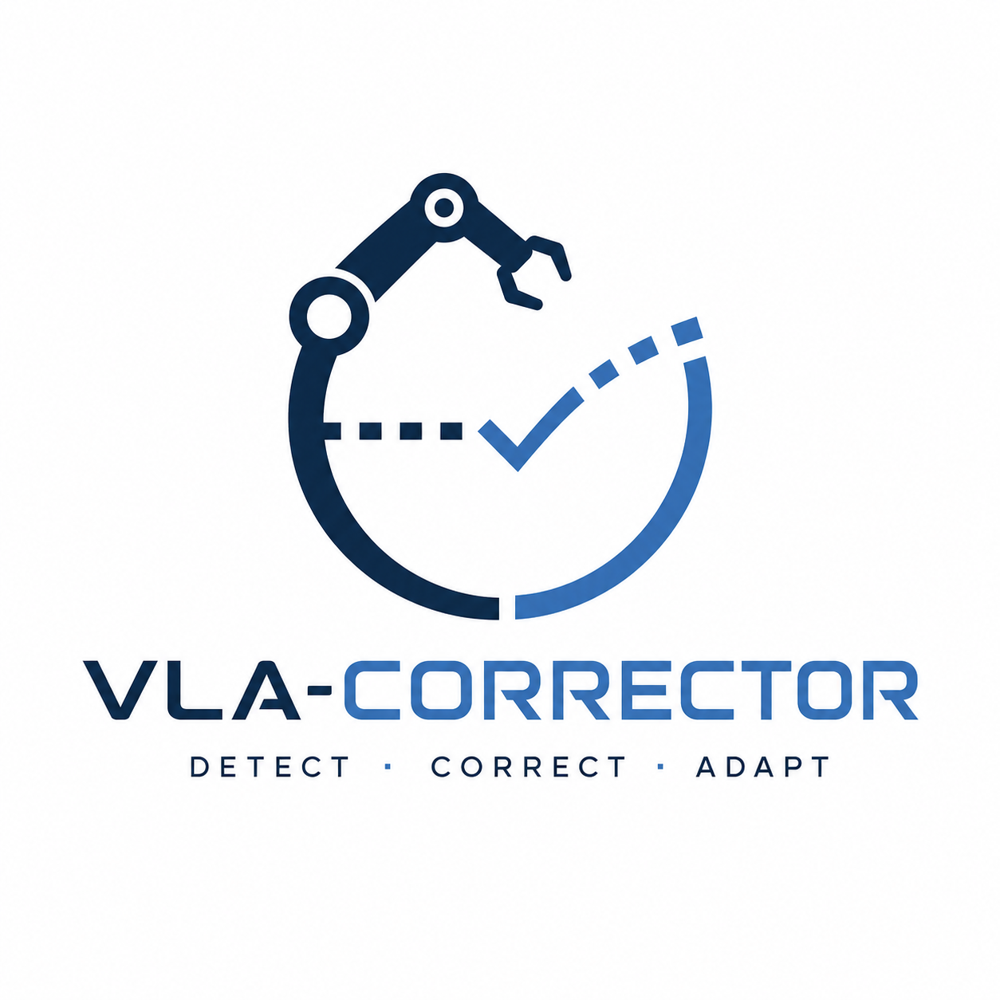

<div align="center">
  

  # VLA-Corrector

  ### VLA-Corrector: Lightweight Detect-and-Correct Inference for Adaptive Action Horizon

  <p>
    Yi Pan<sup>1</sup>, Miao Pan<sup>1</sup>, Qi Lu<sup>1</sup>, Jiaming Huang<sup>1</sup>,
    Man Zhang<sup>1</sup>, Siteng Huang<sup>2</sup>, Xin Li<sup>2</sup>, Jie Zhang<sup>1</sup>,
    Yongliang Shen<sup>1</sup>, Xuhong Zhang<sup>1</sup>, Wenqi Zhang<sup>1</sup><br>
    <sup>1</sup>Zhejiang University &nbsp;&nbsp;·&nbsp;&nbsp; <sup>2</sup>Alibaba DAMO Academy<br>
    <a href="mailto:panyi0304@gmail.com">panyi0304@gmail.com</a> &nbsp;&nbsp;·&nbsp;&nbsp;
    <a href="mailto:zhangwenqi@zju.edu.cn">zhangwenqi@zju.edu.cn</a>
  </p>

  <br/>

  [](https://zju-omniai.github.io/vla-corrector/)
  [](https://github.com/ZJU-OmniAI/vla-corrector)
  [](#citation)
  [](#citation)
  [](#citation)

  <br/>
</div>

---

**VLA-Corrector** is a lightweight detect-and-correct inference framework for action-chunked Vision-Language-Action (VLA) policies. It addresses the open-loop blind spot created by fixed action horizons: fresh observations arrive during execution, but the policy continues following queued actions until the horizon ends.

VLA-Corrector keeps the VLA backbone frozen and adds an external latent dynamics corrector. A Latent-space Vision Monitor (LVM) detects persistent mismatch between predicted and observed visual feature evolution; the system then truncates stale actions and invokes corrective replanning via Online Gradient Guidance (OGG).

## Paper Figures

- [Open-loop versus closed-loop execution](docs/assets/images/teaser_open_loop_vs_closed_loop.png)
- [VLA-Corrector method overview](docs/assets/images/method_overview.png)
- [Performance-efficiency trade-off](docs/assets/images/results_pareto.png)
- [Task-phase truncation analysis](docs/assets/images/truncation_phase_analysis.png)
- [Controlled recovery case](docs/assets/images/qualitative_recovery.png)

These figures are copied from the paper LaTeX source. They are not generated project-page illustrations.

## Abstract

Action-chunked VLA policies reduce policy-call frequency and preserve temporal coherence by executing several future actions before querying the policy again. This design can fail in contact-rich manipulation, where small perturbations, pose drift, or slippage may compound inside the open-loop blind spot.

VLA-Corrector mitigates this issue with an event-triggered adaptive action horizon. During stable execution it preserves the efficiency of long chunks. When latent visual dynamics indicate persistent drift, it truncates the current queue and applies OGG only to the next recovery query. The trainable component is an external lightweight corrector, not the full VLA backbone.

## Method

The paper organizes VLA-Corrector into four parts:

1. **External latent dynamics corrector:** predicts short-horizon latent residuals from frozen VLA visual features and executed actions.
2. **Latent-space Vision Monitor:** compares expected and observed latent visual evolution during action-chunk execution.
3. **Event-triggered truncation:** discards remaining queued actions when persistent drift indicates that the chunk has become stale.
4. **Online Gradient Guidance:** guides the single recovery replan immediately after an interrupt event.

The paper reports residual MLP correctors with approximately **38--42M parameters**, referred to as a lightweight ~40M MLP corrector.

## Results

The following values are summarized from the paper LaTeX draft. See the paper for complete protocols, task splits, and appendix tables.

| Setting | Baseline | + VLA-Corrector | Reported change |
| --- | ---: | ---: | ---: |
| MetaWorld, PI0.5 avg. success | 48.70 | 64.35 | +15.65 |
| MetaWorld, SmolVLA avg. success | 61.90 | 66.65 | +4.75 |
| MetaWorld, X-VLA avg. success | 55.55 | 59.60 | +4.05 |
| LIBERO, PI0.5 few-shot avg. success | 94.00 | 97.80 | +3.80 |
| AgileX PiPER real-world avg. success | 55.6 | 73.3 | +17.7 |

Additional analysis in the paper reports that truncation alone improves MetaWorld average success from 48.70% to 60.35%, while truncation plus OGG reaches 64.35%. The paper also reports that 83.7% of truncations occur in manually labeled critical phases.

## Installation

```bash
conda env create -f environment.yml
conda activate lerobot
python -m pip install -e . --no-build-isolation
```

For PushT simulation smoke tests:

```bash
python -m pip install -e '.[pusht]' --no-build-isolation
```

Alternatively:

```bash
python -m pip install -r requirements.txt
```

The exported environment name is `lerobot`. You can edit the `name:` field in `environment.yml` before creating the environment.

## Data and Checkpoints

This repository does **not** include datasets, demo data, training outputs, Hugging Face pretrained weights, fine-tuned VLA checkpoints, trained corrector checkpoints, wandb logs, or caches.

Prepare or specify these paths yourself:

```text
<DATASET_DIR>             # Source LeRobot, MetaWorld, or LIBERO dataset
<EXTRACTED_CACHE_DIR>     # Extracted latent cache from siglip_dynamics.extract
<POLICY_CHECKPOINT>       # Base or fine-tuned PI0.5, SmolVLA, or X-VLA policy checkpoint
<CORRECTOR_CHECKPOINT>    # Trained latent dynamics corrector checkpoint directory
<OUTPUT_DIR>              # Local output directory, usually under outputs/
```

Known model names referenced by the code include:

```text
HuggingFaceTB/SmolVLM2-500M-Video-Instruct
google/paligemma-3b-pt-224
lerobot/fast-action-tokenizer
```

Fine-tuned checkpoints are not included. Please specify your own checkpoint paths with `--policy.path` and `--safety_model_path`.

## Corrector Training

Latent extraction:

```bash
python -m siglip_dynamics.extract \
  --dataset-path <DATASET_DIR> \
  --dataset-repo-id <DATASET_REPO_ID> \
  --dataset-loader parquet \
  --dataset-format <metaworld_or_libero> \
  --output-path <EXTRACTED_CACHE_DIR> \
  --encoder-backend <pi05_or_smolvla_or_xvla> \
  --use-normalized-delta-action \
  --encoder-policy-path <POLICY_CHECKPOINT> \
  --encoder-local-files-only
```

Corrector training:

```bash
torchrun --nproc_per_node=1 -m siglip_dynamics.train \
  --model-type mlp \
  --h-window 1 \
  --k-step-list 10 \
  --dataset-path <EXTRACTED_CACHE_DIR> \
  --batch-size 512 \
  --epochs 30 \
  --train-loss-type cosine \
  --checkpoint-dir <CORRECTOR_CHECKPOINT>
```

## Evaluation

Main modified evaluation entry point:

```bash
python -m lerobot.scripts.lerobot_eval_modified_detection --help
```

PI0.5-style modified evaluation:

```bash
export MUJOCO_GL=egl
export PYOPENGL_PLATFORM=egl
export EGL_PLATFORM=surfaceless

python -m lerobot.scripts.lerobot_eval_modified_detection \
  --policy.path=<POLICY_CHECKPOINT> \
  --policy.device=cuda \
  --policy.n_action_steps=50 \
  --policy.chunk_size=50 \
  --policy.compile_model=false \
  --env.type=metaworld \
  --env.task=<TASK_SPLIT> \
  --env.episode_length=300 \
  --eval.batch_size=1 \
  --eval.n_episodes=20 \
  --eval.use_async_envs=false \
  --env.max_parallel_tasks=1 \
  --seed=1000 \
  --safety_model_path=<CORRECTOR_CHECKPOINT> \
  --safety_k=10 \
  --guidance_eta=1 \
  --guidance_apply_every=1 \
  --guidance_loss_objective=attract_delta_z_correction \
  --guidance_compare_baseline=true \
  --meltdown_cooldown_steps=10 \
  --output_dir=<OUTPUT_DIR> \
  --save_analysis=false \
  --save_raw_video=false \
  --save_summary_csv=true \
  --save_summary_json=true
```

SmolVLA and X-VLA use the same entry point with backbone-specific policy arguments. Full evaluation requires simulator dependencies, GPU resources, datasets, policy checkpoints, and trained corrector checkpoints.

## Repository Structure

```text
.
├── src/lerobot/                 # LeRobot-based codebase and modified VLA policies
├── src/siglip_dynamics/         # Latent extraction and corrector training
├── docs/                        # English GitHub Pages project page
├── media/                       # Non-Pages media materials
├── examples/
├── tests/
├── environment.yml
└── requirements.txt
```

## GitHub Pages

The project page is served from the `/docs` directory via GitHub Pages.

Expected URL:

```text
https://zju-omniai.github.io/vla-corrector/
```

To enable it:

```text
Settings -> Pages -> Build and deployment -> Source: Deploy from a branch
Branch: main
Folder: /docs
```

## Citation

Paper and arXiv links are coming soon. Until a public citation is available, please cite the repository:

```bibtex
@misc{vla_corrector_2026,
  title        = {VLA-Corrector: Lightweight Detect-and-Correct Inference for Adaptive Action Horizon},
  author       = {Pan, Yi and Pan, Miao and Lu, Qi and Huang, Jiaming and Zhang, Man and Huang, Siteng and Li, Xin and Zhang, Jie and Shen, Yongliang and Zhang, Xuhong and Zhang, Wenqi},
  year         = {2026},
  howpublished = {GitHub repository},
  url          = {https://github.com/ZJU-OmniAI/vla-corrector}
}
```

## Acknowledgements

This repository builds on LeRobot and the Hugging Face ecosystem, and references VLA backbones and benchmarks including PI0.5, SmolVLA, X-VLA, MetaWorld, and LIBERO. Please also cite the corresponding upstream projects when using this code.
