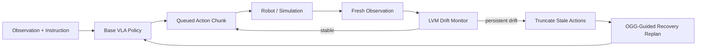

<div align="center">
  

  # VLA-Corrector

  ### A ~40M-parameter corrector for mitigating blind spots in open-loop VLA execution

  <p>
    <a href="https://zju-omniai.github.io/vla-corrector/">Project Page</a> ·
    <a href="https://github.com/ZJU-OmniAI/vla-corrector">Code</a> ·
    <a href="#citation">Paper: Coming soon</a> ·
    <a href="#citation">arXiv: Coming soon</a>
  </p>

  <p>
    
    
    <a href="https://zju-omniai.github.io/vla-corrector/"></a>
    
    
  </p>
</div>

---

**VLA-Corrector** is a lightweight detect-and-correct inference framework for action-chunked Vision-Language-Action (VLA) policies. It keeps the VLA backbone frozen, monitors latent visual dynamics during execution, truncates stale action chunks when persistent drift appears, and guides the next recovery replan with Online Gradient Guidance (OGG).

The paper identifies a practical failure mode in action-chunked VLA control: long horizons reduce policy-call frequency, but they also create an **open-loop blind spot** where fresh observations are ignored until the queued actions finish. VLA-Corrector turns the fixed action horizon into an event-triggered adaptive horizon, preserving efficient long chunks during stable phases and invoking correction only when execution starts to drift.

## Highlights

- **Lightweight ~40M corrector.** The paper reports residual MLP correctors with approximately 38--42M parameters.
- **Open-loop blind-spot mitigation.** LVM monitors mismatch between expected and observed latent visual dynamics while the robot executes queued actions.
- **Plug-in correction path.** The VLA policy weights stay frozen; the trainable module is an external latent dynamics corrector.
- **Event-triggered adaptive horizon.** Persistent drift truncates stale actions instead of blindly executing the remaining chunk.
- **Recovery-guided re-inference.** OGG is applied only to the policy query immediately after an interrupt event.

## Why Correct Open-loop VLA Execution?

Action-chunked VLA policies predict multiple future actions in one call and execute an `H`-step horizon before querying the policy again. This amortizes expensive VLA inference and improves temporal smoothness, but it also means the robot may continue executing stale actions after slippage, collision, pose drift, or an online disturbance.

VLA-Corrector does **not** replace the policy with a new closed-loop controller. Instead, it adds a lightweight correction pathway on top of standard chunked execution: keep the chunk when local dynamics remain consistent, and interrupt it when persistent drift indicates that the remaining actions are no longer reliable.

## Method at a Glance



The detect-and-correct pipeline has four modules:

| Module | Role |
| --- | --- |
| **External latent dynamics corrector** | Predicts short-horizon latent residuals from frozen VLA visual features and executed actions. |
| **Latent-space Vision Monitor (LVM)** | Compares expected and observed latent evolution during chunk execution. |
| **Event-triggered truncation** | Discards remaining queued actions when drift persists under robust thresholding and hysteresis. |
| **Online Gradient Guidance (OGG)** | Guides the single recovery replan after an interrupt toward a corrective latent direction. |

Paper figures:

- [Method overview](docs/assets/images/method_overview.pdf)
- [Open-loop execution comparison](docs/assets/images/open_loop_vs_corrected_execution.pdf)
- [Performance-efficiency trade-off](docs/assets/images/performance_efficiency_pareto.pdf)

## Installation

```bash
conda env create -f environment.yml
conda activate lerobot
python -m pip install -e . --no-build-isolation
```

For PushT simulation smoke tests:

```bash
python -m pip install -e '.[pusht]' --no-build-isolation
```

Alternatively:

```bash
python -m pip install -r requirements.txt
```

The exported environment name is `lerobot`. You can edit the `name:` field in `environment.yml` before creating the environment.

## Data and Checkpoints

This repository does **not** include datasets, demo data, training outputs, Hugging Face pretrained weights, fine-tuned VLA checkpoints, trained corrector checkpoints, wandb logs, or caches.

Prepare or specify these paths yourself:

```text
<DATASET_DIR>             # Source LeRobot, MetaWorld, or LIBERO dataset
<EXTRACTED_CACHE_DIR>     # Extracted latent cache from siglip_dynamics.extract
<POLICY_CHECKPOINT>       # Base or fine-tuned PI0.5, SmolVLA, or X-VLA policy checkpoint
<CORRECTOR_CHECKPOINT>    # Trained latent dynamics corrector checkpoint directory
<OUTPUT_DIR>              # Local output directory, usually under outputs/
```

Known model names referenced by the code include:

```text
HuggingFaceTB/SmolVLM2-500M-Video-Instruct
google/paligemma-3b-pt-224
lerobot/fast-action-tokenizer
```

Fine-tuned checkpoints are not included. Please specify your own checkpoint paths with `--policy.path` and `--safety_model_path`.

## Quick Start

Main modified evaluation entry point:

```bash
python -m lerobot.scripts.lerobot_eval_modified_detection --help
```

Minimal PushT smoke training from a local LeRobot-format dataset:

```bash
python -m lerobot.scripts.lerobot_train \
  --dataset.repo_id=<LOCAL_REPO_ID> \
  --dataset.root=<LOCAL_LEROBOT_DATASET_DIR> \
  --policy.type=act \
  --policy.device=cpu \
  --policy.push_to_hub=false \
  --policy.chunk_size=1 \
  --policy.n_action_steps=1 \
  --batch_size=2 \
  --steps=1 \
  --eval_freq=0 \
  --save_freq=1 \
  --num_workers=0 \
  --output_dir=outputs/train/pusht_smoke
```

Minimal PushT smoke evaluation from a local policy checkpoint:

```bash
python -m lerobot.scripts.lerobot_eval \
  --policy.path=outputs/train/pusht_smoke/checkpoints/000001/pretrained_model \
  --policy.device=cpu \
  --env.type=pusht \
  --env.obs_type=environment_state_agent_pos \
  --env.episode_length=1 \
  --eval.batch_size=1 \
  --eval.n_episodes=1 \
  --eval.use_async_envs=false \
  --output_dir=outputs/eval/pusht_smoke
```

## Training

### Corrector / External Module Training

1. Fine-tune or obtain a VLA policy checkpoint for the benchmark.
2. Freeze the VLA and extract visual latents from demonstration trajectories.
3. Train the external corrector to predict short-horizon latent residuals.
4. Use the trained corrector as `--safety_model_path` during evaluation.

Latent extraction:

```bash
python -m siglip_dynamics.extract \
  --dataset-path <DATASET_DIR> \
  --dataset-repo-id <DATASET_REPO_ID> \
  --dataset-loader parquet \
  --dataset-format <metaworld_or_libero> \
  --output-path <EXTRACTED_CACHE_DIR> \
  --encoder-backend <pi05_or_smolvla_or_xvla> \
  --use-normalized-delta-action \
  --encoder-policy-path <POLICY_CHECKPOINT> \
  --encoder-local-files-only
```

Corrector training:

```bash
torchrun --nproc_per_node=1 -m siglip_dynamics.train \
  --model-type mlp \
  --h-window 1 \
  --k-step-list 10 \
  --dataset-path <EXTRACTED_CACHE_DIR> \
  --batch-size 512 \
  --epochs 30 \
  --train-loss-type cosine \
  --checkpoint-dir <CORRECTOR_CHECKPOINT>
```

Optional train-ratio sweep:

```bash
python -m siglip_dynamics.train_split_sweep \
  --dataset-path <EXTRACTED_CACHE_DIR> \
  --output-dir outputs/sweeps/siglip_dynamics \
  --model-types mlp transformer dit \
  --train-ratios 0.1 0.25 0.5 0.75 1.0 \
  --k-step 10 \
  --mlp-h-window 1 \
  --seq-h-window 5 \
  --epochs 30 \
  --train-loss-type both
```

### Simulation Training

The original LeRobot policy training entry point is retained:

```bash
python -m lerobot.scripts.lerobot_train --help
```

## Evaluation

PI0.5-style modified evaluation:

```bash
export MUJOCO_GL=egl
export PYOPENGL_PLATFORM=egl
export EGL_PLATFORM=surfaceless

python -m lerobot.scripts.lerobot_eval_modified_detection \
  --policy.path=<POLICY_CHECKPOINT> \
  --policy.device=cuda \
  --policy.n_action_steps=50 \
  --policy.chunk_size=50 \
  --policy.compile_model=false \
  --env.type=metaworld \
  --env.task=<TASK_SPLIT> \
  --env.episode_length=300 \
  --eval.batch_size=1 \
  --eval.n_episodes=20 \
  --eval.use_async_envs=false \
  --env.max_parallel_tasks=1 \
  --seed=1000 \
  --safety_model_path=<CORRECTOR_CHECKPOINT> \
  --safety_k=10 \
  --guidance_eta=1 \
  --guidance_apply_every=1 \
  --guidance_loss_objective=attract_delta_z_correction \
  --guidance_compare_baseline=true \
  --meltdown_cooldown_steps=10 \
  --output_dir=<OUTPUT_DIR> \
  --save_analysis=false \
  --save_raw_video=false \
  --save_summary_csv=true \
  --save_summary_json=true
```

SmolVLA and X-VLA use the same entry point with backbone-specific policy arguments. For example, SmolVLA may specify:

```bash
--policy.vlm_model_name=HuggingFaceTB/SmolVLM2-500M-Video-Instruct
```

X-VLA may require observation-key remapping:

```bash
--rename_map='{"observation.image":"observation.images.image"}'
```

Full evaluation requires simulator dependencies, GPU resources, datasets, policy checkpoints, and trained corrector checkpoints. Missing checkpoints should produce explicit path errors rather than private-path assumptions.

## Results

The following values are summarized from the paper LaTeX draft. See the paper for full protocols, task splits, and appendix tables.

### MetaWorld Cross-Architecture Evaluation

| Backbone | Baseline Avg. Success | + VLA-Corrector Avg. Success | Absolute Gain |
| --- | ---: | ---: | ---: |
| PI0.5 | 48.70 | 64.35 | +15.65 |
| SmolVLA | 61.90 | 66.65 | +4.75 |
| X-VLA | 55.55 | 59.60 | +4.05 |

### Additional Reported Findings

| Setting | Paper-reported result |
| --- | --- |
| LIBERO PI0.5 few-shot | 94.00 -> 97.80 average success with VLA-Corrector |
| Real AgileX PiPER | 55.6 -> 73.3 average success across three task groups |
| Truncation ablation | 48.70 -> 60.35 with truncation only; 64.35 with truncation + OGG |
| LVM timing analysis | 83.7% of truncations occur in manually labeled critical phases |
| Policy-call efficiency | Largest reported success-per-call gains: 29.9% PI0.5, 45.3% SmolVLA, 39.1% X-VLA |

## Repository Structure

```text
.
├── src/lerobot/                 # LeRobot-based codebase and modified VLA policies
│   ├── scripts/                 # Training, evaluation, and modified detection entry points
│   ├── policies/pi05_modified/  # PI0.5 detect-and-correct wrapper
│   ├── policies/smolvla_modified/
│   ├── policies/xvla_modified/
│   └── safety/                  # Runtime dynamics predictor loader
├── src/siglip_dynamics/         # Latent extraction and corrector training
├── docs/                        # English GitHub Pages project page and technical notes
├── media/                       # Non-Pages media materials
├── examples/                    # LeRobot examples retained from the base project
├── tests/                       # Source tests; large artifacts are excluded
├── environment.yml
└── requirements.txt
```

## Project Page

The project page is served from the `/docs` directory via GitHub Pages.

Expected URL:

```text
https://zju-omniai.github.io/vla-corrector/
```

To enable it:

```text
Settings -> Pages -> Build and deployment -> Source: Deploy from a branch
Branch: main
Folder: /docs
```

## Citation

Paper and arXiv links are coming soon. Until a public citation is available, please cite the repository:

```bibtex
@misc{vla_corrector_2026,
  title        = {VLA-Corrector: Lightweight Detect-and-Correct Inference for Adaptive Action Horizon},
  author       = {Pan, Yi and Pan, Miao and Lu, Qi and Huang, Jiaming and Zhang, Man and Zhang, Wenqi},
  year         = {2026},
  howpublished = {GitHub repository},
  url          = {https://github.com/ZJU-OmniAI/vla-corrector}
}
```

## Acknowledgements

This repository builds on LeRobot and the Hugging Face ecosystem, and references VLA backbones and benchmarks including PI0.5, SmolVLA, X-VLA, MetaWorld, and LIBERO. Please also cite the corresponding upstream projects when using this code.
