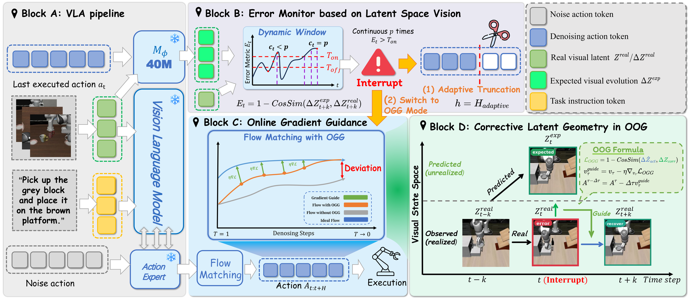

<div align="center">
  

  # VLA-Corrector

  <p>
    <a href="README.md">English</a> | <strong>中文</strong>
  </p>

  ### VLA-Corrector: Lightweight Detect-and-Correct Inference for Adaptive Action Horizon

  <p>
    Yi Pan<sup>1</sup>, Miao Pan<sup>1</sup>, Qi Lu<sup>1</sup>, Jiaming Huang<sup>1</sup>,
    Man Zhang<sup>1</sup>, Siteng Huang<sup>2</sup>, Xin Li<sup>2</sup>, Jie Zhang<sup>1</sup>,
    Yongliang Shen<sup>1</sup>, Xuhong Zhang<sup>1</sup>, Wenqi Zhang<sup>1</sup><br>
    <sup>1</sup>Zhejiang University &nbsp;&nbsp;·&nbsp;&nbsp; <sup>2</sup>Alibaba DAMO Academy<br>
    <a href="mailto:panyi0304@gmail.com">panyi0304@gmail.com</a> &nbsp;&nbsp;·&nbsp;&nbsp;
    <a href="mailto:zhangwenqi@zju.edu.cn">zhangwenqi@zju.edu.cn</a>
  </p>

  <br/>

  [](https://zju-omniai.github.io/vla-corrector/)
  [](https://github.com/ZJU-OmniAI/vla-corrector)
  [](#citation)
  [](#citation)

  <br/>
</div>

---

**VLA-Corrector** 是一个面向 action-chunked Vision-Language-Action (VLA) 策略的轻量级 detect-and-correct 推理框架。它关注固定动作窗口带来的 open-loop blind spot：执行过程中新的观测已经到来，但策略仍可能继续执行队列中的旧动作，直到固定 horizon 结束。

VLA-Corrector 不重训完整 VLA 主干，而是在推理时加入外部 latent dynamics corrector。Latent-space Vision Monitor (LVM) 比较预测与实际观测到的视觉特征演化；当检测到持续偏移时，系统截断 stale actions，并通过 Online Gradient Guidance (OGG) 触发纠错式 replanning。

## 论文图

<p align="center">
  
</p>

<p align="center"><b>VLA-Corrector 方法总览。</b></p>

该图来自论文 LaTeX 源文件，不是额外生成的网页示意图。

## 摘要

Action-chunked VLA 通过一次生成多个未来动作来降低策略调用频率，并保持时间连续性。但在接触丰富的操作任务中，扰动、姿态漂移或滑移可能在 open-loop blind spot 内持续累积。

VLA-Corrector 将固定动作 horizon 改造成事件触发的 adaptive action horizon。执行稳定时，它保留长 chunk 的效率；当 latent visual dynamics 显示持续偏移时，它截断当前动作队列，并只对下一次 recovery query 应用 OGG。可训练组件是外部轻量 corrector，而不是完整 VLA backbone。

## 方法

论文将 VLA-Corrector 组织为四个核心部分：

1. **External latent dynamics corrector:** 基于冻结 VLA 视觉特征和已执行动作预测短期 latent residual。
2. **Latent-space Vision Monitor:** 在 action-chunk 执行过程中比较期望和实际的 latent visual evolution。
3. **Event-triggered truncation:** 当持续偏移表明当前 chunk 已经过期时，丢弃剩余队列动作。
4. **Online Gradient Guidance:** 在 interrupt event 后，对单次 recovery replan 进行引导。

论文报告的 residual MLP corrector 参数量约为 **38--42M**，因此可视为轻量级约 40M MLP corrector。

## 结果

以下结果来自论文 LaTeX 草稿摘要。完整协议、任务划分和附录表格请以论文为准。

| 设置 | Baseline | + VLA-Corrector | 提升 |
| --- | ---: | ---: | ---: |
| MetaWorld, PI0.5 avg. success | 48.70 | 64.35 | +15.65 |
| MetaWorld, SmolVLA avg. success | 61.90 | 66.65 | +4.75 |
| MetaWorld, X-VLA avg. success | 55.55 | 59.60 | +4.05 |
| LIBERO, PI0.5 few-shot avg. success | 94.00 | 97.80 | +3.80 |
| AgileX PiPER real-world avg. success | 55.6 | 73.3 | +17.7 |

论文还报告：在 MetaWorld 组件消融中，仅 truncation 将平均成功率从 48.70% 提升到 60.35%，truncation + OGG 达到 64.35%。此外，83.7% 的 truncations 发生在人工标注的关键阶段。

## 环境安装

```bash
conda env create -f environment.yml
conda activate lerobot
python -m pip install -e . --no-build-isolation
```

PushT 仿真 smoke test 可安装：

```bash
python -m pip install -e '.[pusht]' --no-build-isolation
```

或者：

```bash
python -m pip install -r requirements.txt
```

导出的环境名为 `lerobot`。如需避免环境名冲突，可以在创建环境前修改 `environment.yml` 的 `name:` 字段。

## 数据与权重

本仓库**不包含**数据集、原始 demonstration data、训练输出、Hugging Face 预训练权重、微调后的 VLA checkpoint、训练后的 corrector checkpoint、wandb 日志或缓存。项目主页只包含压缩后的无声真机展示视频。

请自行准备或指定以下路径：

```text
<DATASET_DIR>             # LeRobot、MetaWorld 或 LIBERO 数据集
<EXTRACTED_CACHE_DIR>     # siglip_dynamics.extract 提取后的 latent cache
<POLICY_CHECKPOINT>       # PI0.5、SmolVLA 或 X-VLA policy checkpoint
<CORRECTOR_CHECKPOINT>    # 训练后的 latent dynamics corrector checkpoint 目录
<OUTPUT_DIR>              # 本地输出目录，通常位于 outputs/
```

代码中引用的 Hugging Face 模型包括：

| 组件 | Hugging Face 仓库 | 源码位置 |
| --- | --- | --- |
| PI0.5 base policy | [`lerobot/pi05_base`](https://huggingface.co/lerobot/pi05_base) | `tests/policies/pi0_pi05/test_pi05_original_vs_lerobot.py` |
| SmolVLA base policy | [`lerobot/smolvla_base`](https://huggingface.co/lerobot/smolvla_base) | `src/lerobot/policies/smolvla/modeling_smolvla.py` |
| X-VLA WidowX policy | [`lerobot/xvla-widowx`](https://huggingface.co/lerobot/xvla-widowx) | `tests/policies/xvla/test_xvla_original_vs_lerobot.py` |
| SmolVLA VLM backbone | [`HuggingFaceTB/SmolVLM2-500M-Video-Instruct`](https://huggingface.co/HuggingFaceTB/SmolVLM2-500M-Video-Instruct) | `src/lerobot/policies/smolvla/configuration_smolvla.py` |
| PI0/PI0.5 tokenizer backbone | [`google/paligemma-3b-pt-224`](https://huggingface.co/google/paligemma-3b-pt-224) | `src/lerobot/policies/pi05/processor_pi05.py` |
| Fast action tokenizer | [`lerobot/fast-action-tokenizer`](https://huggingface.co/lerobot/fast-action-tokenizer) | `src/lerobot/scripts/lerobot_train_tokenizer.py` |

微调权重不包含在仓库中。请通过 `--policy.path` 和 `--safety_model_path` 指定自己的 checkpoint。

## Corrector 训练

Latent extraction:

```bash
python -m siglip_dynamics.extract \
  --dataset-path <DATASET_DIR> \
  --dataset-repo-id <DATASET_REPO_ID> \
  --dataset-loader parquet \
  --dataset-format <metaworld_or_libero> \
  --output-path <EXTRACTED_CACHE_DIR> \
  --encoder-backend <pi05_or_smolvla_or_xvla> \
  --use-normalized-delta-action \
  --encoder-policy-path <POLICY_CHECKPOINT> \
  --encoder-local-files-only
```

Corrector training:

```bash
torchrun --nproc_per_node=1 -m siglip_dynamics.train \
  --model-type mlp \
  --h-window 1 \
  --k-step-list 10 \
  --dataset-path <EXTRACTED_CACHE_DIR> \
  --batch-size 512 \
  --epochs 30 \
  --train-loss-type cosine \
  --checkpoint-dir <CORRECTOR_CHECKPOINT>
```

## 评测

主要评测入口：

```bash
python -m lerobot.scripts.lerobot_eval_modified_detection --help
```

PI0.5-style modified evaluation:

```bash
export MUJOCO_GL=egl
export PYOPENGL_PLATFORM=egl
export EGL_PLATFORM=surfaceless

python -m lerobot.scripts.lerobot_eval_modified_detection \
  --policy.path=<POLICY_CHECKPOINT> \
  --policy.device=cuda \
  --policy.n_action_steps=10 \
  --policy.chunk_size=50 \
  --policy.compile_model=false \
  --env.type=metaworld \
  --env.task=<TASK_SPLIT> \
  --env.episode_length=300 \
  --eval.batch_size=1 \
  --eval.n_episodes=20 \
  --eval.use_async_envs=false \
  --env.max_parallel_tasks=1 \
  --seed=1000 \
  --safety_model_path=<CORRECTOR_CHECKPOINT> \
  --safety_k=10 \
  --guidance_eta=1 \
  --guidance_apply_every=1 \
  --guidance_loss_objective=attract_delta_z_correction \
  --guidance_compare_baseline=true \
  --meltdown_cooldown_steps=10 \
  --output_dir=<OUTPUT_DIR> \
  --save_analysis=false \
  --save_raw_video=false \
  --save_summary_csv=true \
  --save_summary_json=true
```

SmolVLA 和 X-VLA 使用同一评测入口，但需要设置对应 backbone 的 policy 参数。完整评测需要仿真依赖、GPU、数据集、policy checkpoint 和训练后的 corrector checkpoint。

## 仓库结构

```text
.
├── src/lerobot/                 # 基于 LeRobot 的代码与修改后的 VLA policy
├── src/siglip_dynamics/         # Latent extraction 与 corrector 训练
├── docs/                        # 中英文项目主页
├── media/                       # 非 Pages 宣传材料
├── examples/
├── tests/
├── environment.yml
└── requirements.txt
```

## Citation

论文和 arXiv 链接暂未公开。在正式引用信息发布前，请暂时引用仓库：

```bibtex
@misc{vla_corrector_2026,
  title        = {VLA-Corrector: Lightweight Detect-and-Correct Inference for Adaptive Action Horizon},
  author       = {Pan, Yi and Pan, Miao and Lu, Qi and Huang, Jiaming and Zhang, Man and Huang, Siteng and Li, Xin and Zhang, Jie and Shen, Yongliang and Zhang, Xuhong and Zhang, Wenqi},
  year         = {2026},
  howpublished = {GitHub repository},
  url          = {https://github.com/ZJU-OmniAI/vla-corrector}
}
```

## 致谢

本仓库基于 LeRobot 和 Hugging Face 生态构建，并使用或参考 PI0.5、SmolVLA、X-VLA、MetaWorld 和 LIBERO 等 VLA backbone 与 benchmark。使用本代码时，也请引用相应上游项目。
